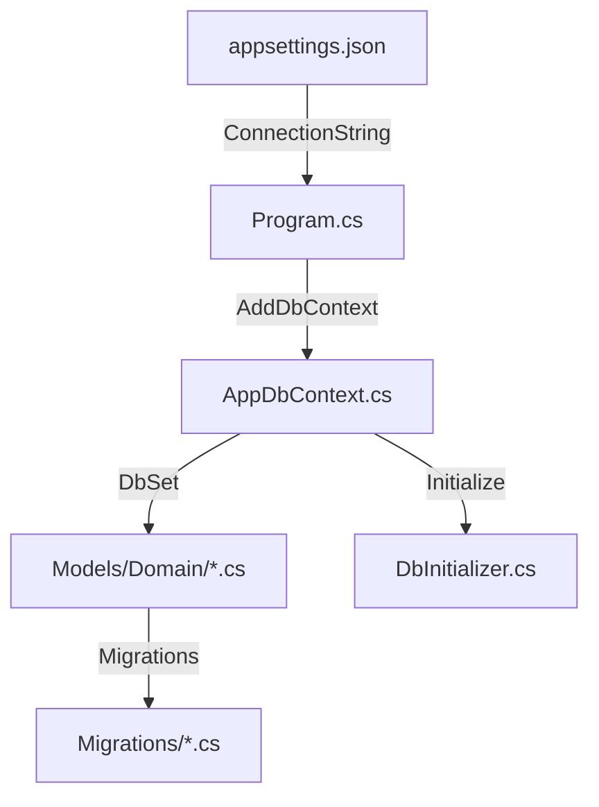

# Architecture Base de Données - EcommerceDropshipping

## Flux de Connexion



## Fichiers Essentiels

### 1. Configuration de Connexion
| Fichier | Rôle |
|---------|------|
| `appsettings.json` | Contient la **ConnectionString** vers SQL Server |

```json
"ConnectionStrings": {
  "DefaultConnection": "Server=(localdb)\\mssqllocaldb;Database=EcommerceDropshipping;..."
}
```

---

### 2. Configuration dans Program.cs
| Fichier | Rôle |
|---------|------|
| `Program.cs` | Enregistre le DbContext dans le conteneur DI |

```csharp
builder.Services.AddDbContext<AppDbContext>(options =>
    options.UseSqlServer(builder.Configuration.GetConnectionString("DefaultConnection")));
```

---

### 3. Contexte de Base de Données
| Fichier | Rôle |
|---------|------|
| `Data/AppDbContext.cs` | Définit les **DbSet** (tables) et la configuration EF Core |

Contient:
- `DbSet<Client>` → Table Clients
- `DbSet<Produit>` → Table Produits
- `DbSet<Commande>` → Table Commandes
- `DbSet<Panier>` → Table Paniers
- etc.

---

### 4. Modèles (Entités)
| Dossier | Fichiers |
|---------|----------|
| `Models/Domain/` | Toutes les entités mappées aux tables |

- `Client.cs` - Utilisateurs
- `Produit.cs` - Produits
- `Fournisseur.cs` - Fournisseurs
- `Commande.cs` - Commandes
- `LigneCommande.cs` - Lignes de commande
- `Panier.cs` - Paniers persistants
- `LignePanier.cs` - Articles du panier
- `Adresse.cs` - Adresses de livraison

---

### 5. Initialisation des Données
| Fichier | Rôle |
|---------|------|
| `Data/DbInitializer.cs` | Seed des données initiales (produits, fournisseurs, admin) |

---

### 6. Migrations
| Dossier | Rôle |
|---------|------|
| `Migrations/` | Historique des modifications du schéma DB |

## Commandes Utiles

```bash
# Créer une migration
dotnet ef migrations add NomMigration

# Appliquer les migrations
dotnet ef database update

# Voir les migrations en attente
dotnet ef migrations list
```
