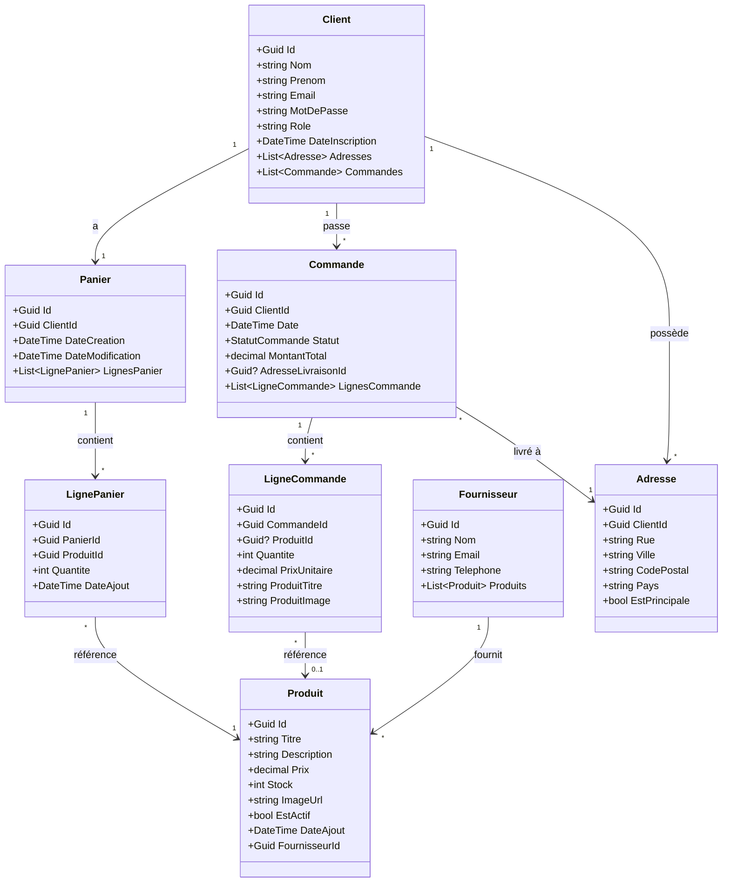
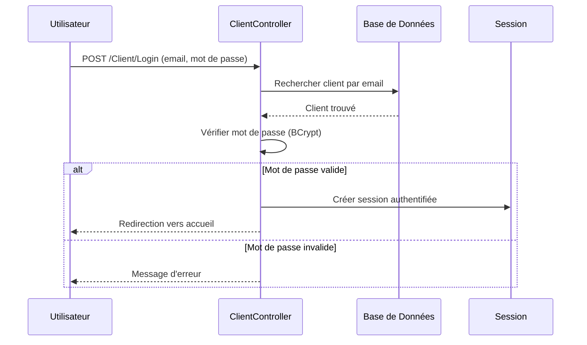
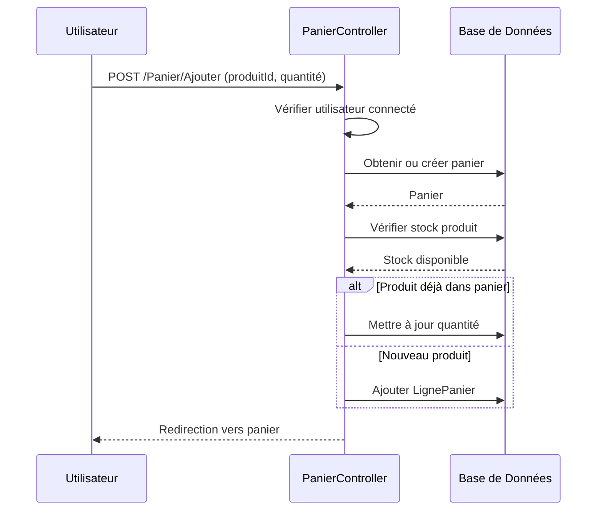
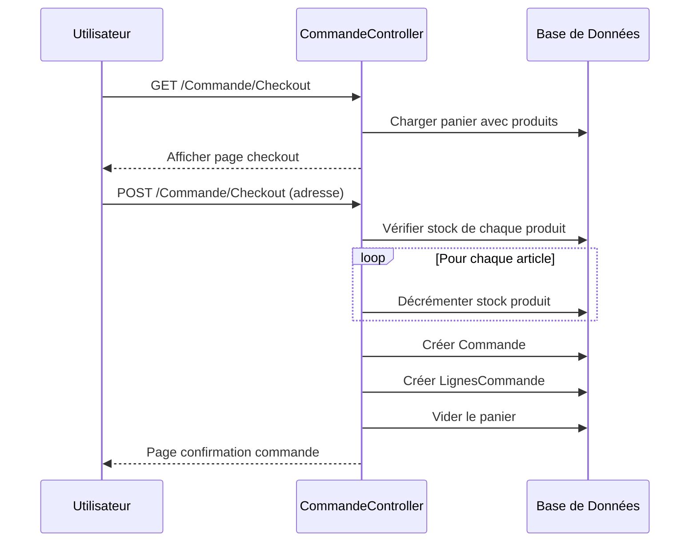
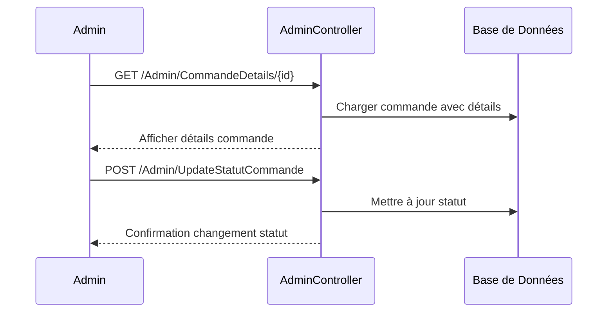

# 🛒 DropShop - E-commerce Dropshipping Platform

## 📋 Table des Matières
- [Introduction](#-introduction)
- [Technologies Utilisées](#-technologies-utilisées)
- [Architecture du Projet](#-architecture-du-projet)
- [Structure des Dossiers](#-structure-des-dossiers)
- [Modèles de Données](#-modèles-de-données)
- [Diagramme de Classes](#-diagramme-de-classes)
- [Diagrammes de Séquence](#-diagrammes-de-séquence)
- [Fonctionnalités](#-fonctionnalités)
- [Installation](#-installation)
- [Configuration](#-configuration)
- [Guide d'Utilisation](#-guide-dutilisation)

---

## 🎯 Introduction

**DropShop** est une plateforme e-commerce complète développée en ASP.NET Core MVC. Elle permet aux clients de parcourir des produits, de les ajouter au panier, et de passer des commandes. Les administrateurs peuvent gérer les produits, les fournisseurs, et suivre les commandes.

### Qu'est-ce que le Dropshipping?
Le dropshipping est un modèle commercial où le vendeur ne stocke pas les produits. Quand un client passe une commande, le produit est expédié directement par le fournisseur au client.

---

## 🛠 Technologies Utilisées

| Technologie | Description | Version |
|-------------|-------------|---------|
| **ASP.NET Core MVC** | Framework web pour construire l'application | .NET 8 |
| **Entity Framework Core** | ORM pour la gestion de base de données | 8.0 |
| **SQL Server** | Base de données relationnelle | LocalDB |
| **Bootstrap 5** | Framework CSS pour l'interface utilisateur | 5.3 |
| **Font Awesome** | Bibliothèque d'icônes | 6.0 |
| **BCrypt.Net** | Hachage sécurisé des mots de passe | - |

### Concepts Clés pour Débutants

- **MVC (Model-View-Controller)**: Pattern architectural qui sépare l'application en 3 parties:
  - **Model**: Les données (classes C#)
  - **View**: L'interface utilisateur (fichiers .cshtml)
  - **Controller**: La logique métier (traite les requêtes)

- **ORM (Object-Relational Mapping)**: Permet de manipuler la base de données avec des objets C# au lieu d'écrire du SQL directement.

---

## 🏗 Architecture du Projet

```
┌─────────────────────────────────────────────────────────────┐
│                        NAVIGATEUR                           │
│                     (Client HTTP)                           │
└─────────────────────────┬───────────────────────────────────┘
                          │ HTTP Request
                          ▼
┌─────────────────────────────────────────────────────────────┐
│                      CONTROLLERS                            │
│  ┌──────────┐ ┌──────────┐ ┌──────────┐ ┌──────────┐       │
│  │  Home    │ │  Admin   │ │ Commande │ │  Panier  │ ...   │
│  └──────────┘ └──────────┘ └──────────┘ └──────────┘       │
└─────────────────────────┬───────────────────────────────────┘
                          │
          ┌───────────────┼───────────────┐
          ▼               ▼               ▼
┌─────────────┐   ┌─────────────┐   ┌─────────────┐
│  ViewModels │   │   Models    │   │    Views    │
│  (DTO)      │   │  (Domain)   │   │  (.cshtml)  │
└─────────────┘   └──────┬──────┘   └─────────────┘
                         │
                         ▼
┌─────────────────────────────────────────────────────────────┐
│                     AppDbContext                            │
│              (Entity Framework Core)                        │
└─────────────────────────┬───────────────────────────────────┘
                          │
                          ▼
┌─────────────────────────────────────────────────────────────┐
│                    SQL Server Database                      │
│     ┌─────────┐ ┌─────────┐ ┌─────────┐ ┌─────────┐        │
│     │ Clients │ │Produits │ │Commandes│ │ Paniers │  ...   │
│     └─────────┘ └─────────┘ └─────────┘ └─────────┘        │
└─────────────────────────────────────────────────────────────┘
```

---

## 📁 Structure des Dossiers

```
EcommerceDropshipping/
├── 📂 Controllers/           # Contrôleurs MVC (logique métier)
│   ├── HomeController.cs     # Page d'accueil, catalogue
│   ├── AdminController.cs    # Dashboard, gestion backoffice
│   ├── ClientController.cs   # Authentification, profil
│   ├── CommandeController.cs # Checkout, historique commandes
│   ├── PanierController.cs   # Gestion du panier
│   └── ProduitController.cs  # Détails produit
│
├── 📂 Models/Domain/         # Entités de base de données
│   ├── Client.cs             # Utilisateur (client/admin)
│   ├── Produit.cs            # Produit du catalogue
│   ├── Fournisseur.cs        # Fournisseur dropshipping
│   ├── Commande.cs           # Commande passée
│   ├── LigneCommande.cs      # Article dans une commande
│   ├── Panier.cs             # Panier persistant
│   ├── LignePanier.cs        # Article dans le panier
│   ├── Adresse.cs            # Adresse de livraison
│   └── Enums/
│       └── StatutCommande.cs # États d'une commande
│
├── 📂 ViewModels/            # Objets de transfert de données
│   ├── Admin/                # ViewModels pour l'admin
│   ├── Produit/              # ViewModels pour les produits
│   ├── Commande/             # ViewModels pour les commandes
│   └── ...
│
├── 📂 Views/                 # Fichiers Razor (interface)
│   ├── Home/                 # Pages publiques
│   ├── Admin/                # Backoffice administrateur
│   ├── Shared/               # Layouts, composants partagés
│   └── ...
│
├── 📂 Data/                  # Couche d'accès aux données
│   ├── AppDbContext.cs       # Contexte Entity Framework
│   └── DbInitializer.cs      # Données de seed initiales
│
├── 📂 ViewComponents/        # Composants réutilisables
│   └── CartCountViewComponent.cs  # Badge panier navbar
│
├── 📂 wwwroot/               # Fichiers statiques
│   ├── css/                  # Feuilles de style
│   ├── js/                   # Scripts JavaScript
│   ├── lib/                  # Bibliothèques (Bootstrap, jQuery)
│   └── uploads/              # Images uploadées
│
├── 📂 Migrations/            # Historique des migrations DB
├── Program.cs                # Point d'entrée de l'application
└── appsettings.json          # Configuration (connexion DB)
```

---

## 📊 Modèles de Données

### Entités Principales

#### 👤 Client
Représente un utilisateur du système (client ou administrateur).

| Propriété | Type | Description |
|-----------|------|-------------|
| Id | Guid | Identifiant unique |
| Nom | string | Nom de famille |
| Prenom | string | Prénom |
| Email | string | Email (unique, pour connexion) |
| MotDePasse | string | Mot de passe hashé (BCrypt) |
| Role | string | "Client" ou "Admin" |
| DateInscription | DateTime | Date de création du compte |

#### 📦 Produit
Représente un article du catalogue.

| Propriété | Type | Description |
|-----------|------|-------------|
| Id | Guid | Identifiant unique |
| Titre | string | Nom du produit |
| Description | string | Description détaillée |
| Prix | decimal | Prix de vente (€) |
| Stock | int | Quantité disponible |
| ImageUrl | string | URL ou chemin de l'image |
| EstActif | bool | Visible sur le site |
| FournisseurId | Guid | Référence au fournisseur |

#### 🛒 Commande
Représente une commande passée par un client.

| Propriété | Type | Description |
|-----------|------|-------------|
| Id | Guid | Identifiant unique |
| ClientId | Guid | Client qui a passé la commande |
| Date | DateTime | Date de la commande |
| Statut | StatutCommande | État actuel (enum) |
| MontantTotal | decimal | Total de la commande |

#### 📋 StatutCommande (Enum)
```
EnAttente  → Commande reçue, en attente de traitement
EnCours    → Commande en préparation
Expediee   → Commande envoyée
Livree     → Commande reçue par le client
Annulee    → Commande annulée
```

---

## 🔷 Diagramme de Classes



---

## 📈 Diagrammes de Séquence

### 1. Processus de Connexion



### 2. Ajout au Panier



### 3. Processus de Commande (Checkout)



### 4. Gestion Admin - Mise à jour Statut Commande



---

## ✨ Fonctionnalités

### 👥 Côté Client
- ✅ Inscription et connexion sécurisée
- ✅ Parcourir le catalogue de produits
- ✅ Recherche et filtrage de produits
- ✅ Ajouter/modifier/supprimer articles du panier
- ✅ Panier persistant (sauvegardé en base)
- ✅ Passer une commande avec adresse de livraison
- ✅ Consulter l'historique des commandes
- ✅ Gérer son profil et ses adresses

### 🔧 Côté Administrateur
- ✅ Dashboard avec statistiques (ventes, revenus, etc.)
- ✅ Gestion complète des produits (CRUD)
- ✅ Upload d'images produits (fichier ou URL)
- ✅ Gestion des fournisseurs
- ✅ Suivi et mise à jour des commandes
- ✅ Filtrage des commandes par statut

---

## 🚀 Installation

### Prérequis
- [.NET 8 SDK](https://dotnet.microsoft.com/download/dotnet/8.0)
- [SQL Server LocalDB](https://docs.microsoft.com/en-us/sql/database-engine/configure-windows/sql-server-express-localdb) ou SQL Server
- [Visual Studio 2022](https://visualstudio.microsoft.com/) (recommandé) ou VS Code

### Étapes d'Installation

```bash
# 1. Cloner le repository
git clone https://github.com/yassagr/EcommerceDropshipping.git
cd EcommerceDropshipping/EcommerceDropshipping

# 2. Restaurer les packages NuGet
dotnet restore

# 3. Appliquer les migrations de base de données
dotnet ef database update

# 4. Lancer l'application
dotnet run
```

### Accès à l'Application
- **Site**: http://localhost:5010
- **Admin**: admin@ecommerce.com / Admin123!
- **Client test**: jean.dupont@email.com / Client123!

---

## ⚙ Configuration

### Fichier `appsettings.json`

```json
{
  "ConnectionStrings": {
    "DefaultConnection": "Server=(localdb)\\mssqllocaldb;Database=EcommerceDropshipping;Trusted_Connection=True;"
  },
  "Logging": {
    "LogLevel": {
      "Default": "Information"
    }
  }
}
```

### Changer la Base de Données
Pour utiliser SQL Server au lieu de LocalDB:
```json
"DefaultConnection": "Server=MON_SERVEUR;Database=EcommerceDropshipping;User Id=USER;Password=PASSWORD;"
```

---

## 📖 Guide d'Utilisation

### Pour les Développeurs

#### Ajouter un Nouveau Contrôleur
```csharp
public class MonController : Controller
{
    private readonly AppDbContext _context;
    
    public MonController(AppDbContext context)
    {
        _context = context;  // Injection de dépendance
    }
    
    public async Task<IActionResult> Index()
    {
        var data = await _context.Produits.ToListAsync();
        return View(data);
    }
}
```

#### Créer une Migration
```bash
# Après modification d'un modèle
dotnet ef migrations add NomDeLaMigration
dotnet ef database update
```

#### Structure d'une Vue Razor
```html
@model MonViewModel
@{
    ViewData["Title"] = "Ma Page";
}

<h1>@ViewData["Title"]</h1>
<p>@Model.MaPropriete</p>
```

---

## 📝 Notes Techniques

### Sécurité
- Les mots de passe sont hashés avec **BCrypt** (jamais stockés en clair)
- L'authentification utilise les **Claims** ASP.NET Core
- Les routes admin sont protégées par `[Authorize(Roles = "Admin")]`
- Protection CSRF avec `@Html.AntiForgeryToken()`

### Performances
- Utilisation de `async/await` pour les opérations I/O
- Chargement lazy des relations avec `Include()`
- Pagination recommandée pour les grandes listes

### Bonnes Pratiques Appliquées
- Séparation des préoccupations (MVC)
- ViewModels pour le passage de données aux vues
- Repository pattern via DbContext
- Validation côté serveur avec Data Annotations

---

## 🤝 Contribution

1. Fork le projet
2. Créer une branche (`git checkout -b feature/AmazingFeature`)
3. Commit (`git commit -m 'Add AmazingFeature'`)
4. Push (`git push origin feature/AmazingFeature`)
5. Ouvrir une Pull Request

---

## 📄 Licence

Ce projet est sous licence MIT.

---

**Développé avec ❤️ en ASP.NET Core**
